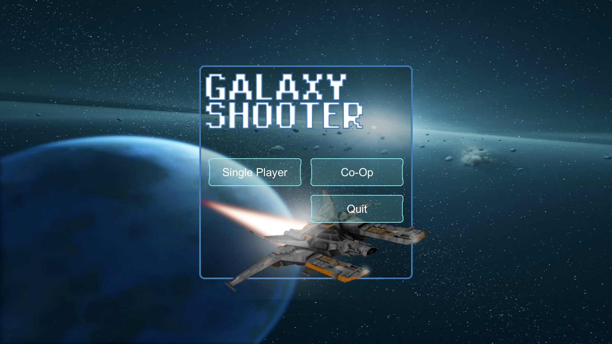
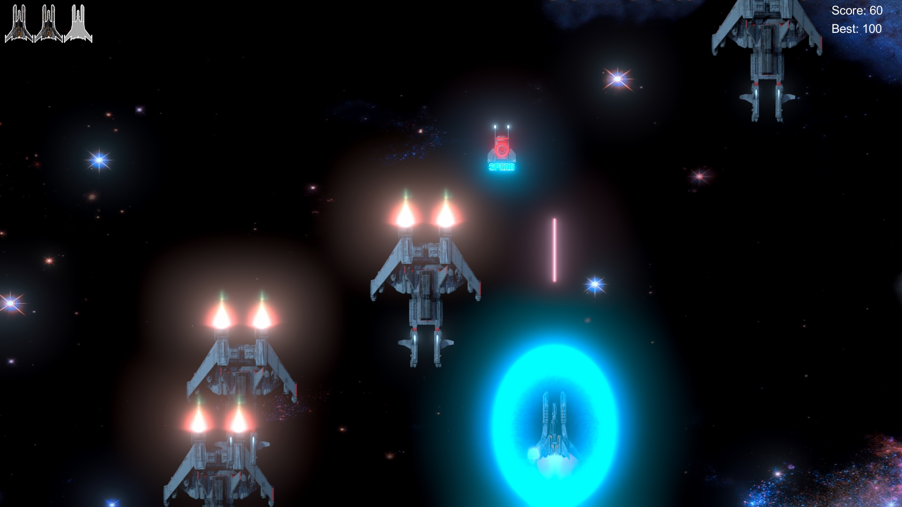
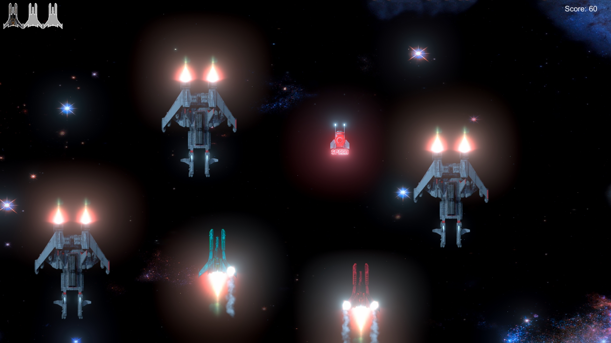

# Galaxy Shooter

## About The Game

Galaxy Shooter is a 2D (with 3D animations) "Space Invaders"-type game I developed in Unity.

It is inspired by the Galaxy Shooter game from "The Ultimate Guide to Game Development with Unity 2019" Udemy course authorized by and made in partnership with Unity Technologies by Jonathan Weinberger.

I created both a PC (Single-Player and Co-Op) and an Android Version (Single-Player).

The games includes features such as:

- Main Menu

- 2 Modes: Single Player, Co-Op

- Limited Lives (3)

- Score and Best Score

- Animations: Player Movement, Player Thruster, Enemy Explosion

- Power-ups: Triple Shot, Speed boost, Shield

- Enemies with basic AI behavior

- Background Music, Sound Effects

- Polished Sprites

- Post-processing effects

## Screenshots PC

### Main Menu:

### Single Player:

### Co-Op:

## Screenshots Android

### Single Player:

### Pause Menu:

